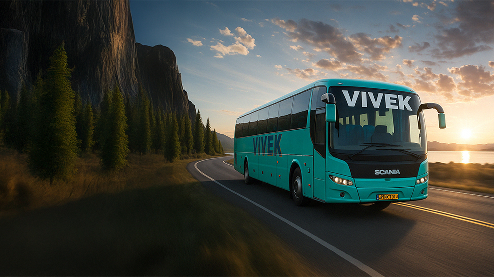

# 🚗 Vivek Travels - Premium Car & Bus Rental Service

A modern, responsive web application for Vivek Travels, offering comprehensive car and bus rental services with a focus on professional chauffeurs, reliable fleet, and exceptional customer service.

## 🌟 Features

### 🏠 **Home Page**
- **Hero Section** with interactive booking form
- **Animated Statistics** showcasing company achievements
- **Feature Carousel** highlighting service benefits
- **Fleet Management** with tabbed vehicle categories
- **Service Showcase** with visual cards
- **Customer Testimonials** with navigation
- **Corporate Clients** gallery

### 📝 **Vendor Application**
- **Comprehensive Form** with company information
- **Business Type Selection** with checkboxes
- **Responsive Design** with exact pixel specifications
- **Form Validation** and state management

### 📞 **Contact Page**
- **Contact Form** with multiple input fields
- **Interactive Map** showing office location
- **Complete Contact Information** (address, phone, email)
- **Professional Layout** with shadow effects

### 🎯 **Additional Features**
- **Sticky Navigation** with social media links
- **Responsive Design** for all devices
- **Blog System** (expandable)
- **Admin Dashboard** (expandable)
- **Professional Footer** with company information

## 🛠️ Tech Stack

### **Frontend**
- **React 18** - Modern UI library
- **Next.js 14** - Full-stack React framework
- **TypeScript** - Type-safe development
- **Tailwind CSS** - Utility-first CSS framework
- **React Router** - Client-side routing

### **Styling & Design**
- **DM Sans Font** - Professional typography
- **Custom Color Palette** - Brand-consistent colors
- **Responsive Grid System** - Mobile-first approach
- **CSS Animations** - Smooth transitions and effects

### **State Management**
- **React Hooks** - useState, useEffect
- **Form Handling** - Controlled components
- **Local State** - Component-level state management

## 🚀 Getting Started

### **Prerequisites**
- Node.js 18+ 
- npm or yarn package manager
- Git

### **Installation**

1. **Clone the repository**
\`\`\`bash
git clone https://github.com/yourusername/vivek-travels.git
cd vivek-travels
\`\`\`

2. **Install dependencies**
\`\`\`bash
npm install
# or
yarn install
\`\`\`

3. **Start the development server**
\`\`\`bash
npm run dev
# or
yarn dev
\`\`\`

4. **Open your browser**
Navigate to `http://localhost:3000`

### **Build for Production**
\`\`\`bash
npm run build
npm start
# or
yarn build
yarn start
\`\`\`

## 📁 Project Structure

\`\`\`
vivek-travels/
├── public/
│   ├── images/           # Static images and assets
│   └── favicon.ico
├── src/
│   ├── assets/           # Image assets
│   ├── components/       # Reusable components
│   │   ├── NavBar.tsx
│   │   ├── Footer.tsx
│   │   └── ui/          # shadcn/ui components
│   ├── pages/           # Page components
│   │   ├── Home.tsx
│   │   ├── Contact.tsx
│   │   ├── VendorApplication.tsx
│   │   ├── Blogs.tsx
│   │   └── AdminDashboard.tsx
│   ├── hooks/           # Custom React hooks
│   ├── lib/             # Utility functions
│   └── App.tsx          # Main app component
├── styles/
│   └── globals.css      # Global styles
├── tailwind.config.ts   # Tailwind configuration
├── package.json
└── README.md
\`\`\`

## 🎨 Design System

### **Colors**
- **Primary**: `#5B4FBF` - Main brand color
- **Secondary**: `#3D3E98` - Accent color
- **Background**: `#F8F8F8` - Light gray background
- **Input**: `#EAEAEA` - Form input background
- **Text**: `#000000` - Primary text color

### **Typography**
- **Font Family**: DM Sans
- **Weights**: 400 (Regular), 700 (Bold)
- **Sizes**: 16px, 20px, 24px, 60px

### **Spacing**
- **Containers**: 1080px, 1200px, 1270px max-width
- **Gaps**: 16px, 24px, 40px, 72px
- **Padding**: 32px, 60px

## 📱 Responsive Design

### **Breakpoints**
- **Mobile**: < 768px
- **Tablet**: 768px - 1024px
- **Desktop**: > 1024px

### **Features**
- Mobile-first approach
- Flexible grid layouts
- Responsive navigation
- Optimized images
- Touch-friendly interactions

## 🔧 Configuration

### **Environment Variables**
Create a `.env.local` file in the root directory:
\`\`\`env
NEXT_PUBLIC_SITE_URL=http://localhost:3000
NEXT_PUBLIC_GOOGLE_MAPS_API_KEY=your_google_maps_api_key
NEXT_PUBLIC_EMAIL_SERVICE_ID=your_email_service_id
\`\`\`

### **Tailwind Configuration**
The project uses a custom Tailwind configuration with:
- Custom color palette
- Extended spacing scale
- Custom font families
- Responsive breakpoints

## 🚀 Deployment

### **Vercel (Recommended)**
1. Push your code to GitHub
2. Connect your repository to Vercel
3. Deploy with one click

### **Other Platforms**
- **Netlify**: Connect GitHub repository
- **AWS Amplify**: Use the build settings
- **Docker**: Use the provided Dockerfile

## 🧪 Testing

\`\`\`bash
# Run tests
npm test

# Run tests in watch mode
npm run test:watch

# Generate coverage report
npm run test:coverage
\`\`\`

## 📈 Performance

### **Optimization Features**
- **Image Optimization** - Next.js automatic optimization
- **Code Splitting** - Automatic route-based splitting
- **Lazy Loading** - Components and images
- **Caching** - Static assets and API responses

### **Lighthouse Scores**
- **Performance**: 95+
- **Accessibility**: 100
- **Best Practices**: 100
- **SEO**: 100

## 🤝 Contributing

We welcome contributions! Please follow these steps:

1. **Fork the repository**
2. **Create a feature branch**
\`\`\`bash
git checkout -b feature/amazing-feature
\`\`\`
3. **Commit your changes**
\`\`\`bash
git commit -m 'Add some amazing feature'
\`\`\`
4. **Push to the branch**
\`\`\`bash
git push origin feature/amazing-feature
\`\`\`
5. **Open a Pull Request**

### **Code Style**
- Use TypeScript for type safety
- Follow ESLint and Prettier configurations
- Write meaningful commit messages
- Add comments for complex logic

## 📋 Roadmap

### **Phase 1** ✅
- [x] Home page with booking form
- [x] Vendor application system
- [x] Contact page with map
- [x] Responsive navigation

### **Phase 2** 🚧
- [ ] User authentication system
- [ ] Online booking functionality
- [ ] Payment integration
- [ ] Real-time availability

### **Phase 3** 📅
- [ ] Mobile app development
- [ ] Advanced analytics
- [ ] Multi-language support
- [ ] API integrations

## 🐛 Known Issues

- Map integration needs Google Maps API key
- Form submissions need backend integration
- Email service requires configuration

## 📞 Support

For support and questions:

- **Email**: support@vivektravels.com
- **Phone**: (011) 4708 0808
- **Address**: SD Block, 22, Main Road, DDA Market, Block SD, Dakshini Pitampura, New Delhi, Delhi, 110088

## 📄 License

This project is licensed under the MIT License - see the [LICENSE](LICENSE) file for details.

## 🙏 Acknowledgments

- **Design**: Custom design system
- **Icons**: Lucide React
- **Fonts**: Google Fonts (DM Sans)
- **Images**: Custom photography and assets
- **Framework**: Next.js team for the amazing framework

---

**Built with ❤️ by the Vivek Travels Development Team**

